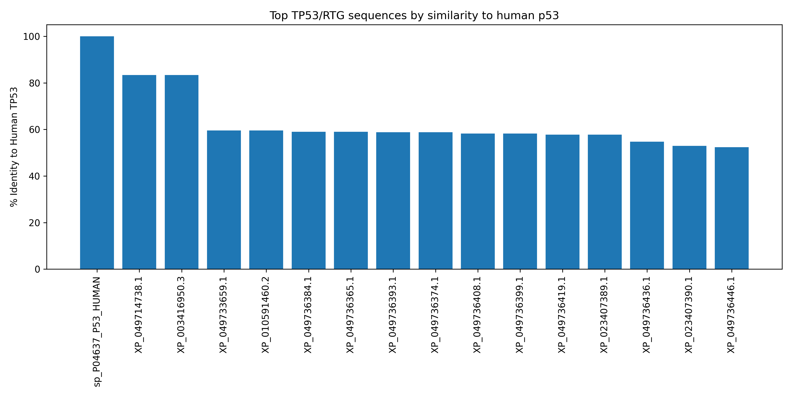
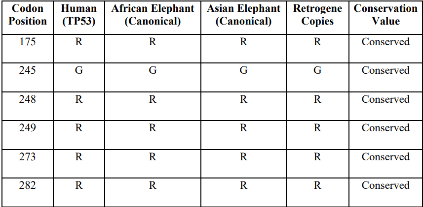
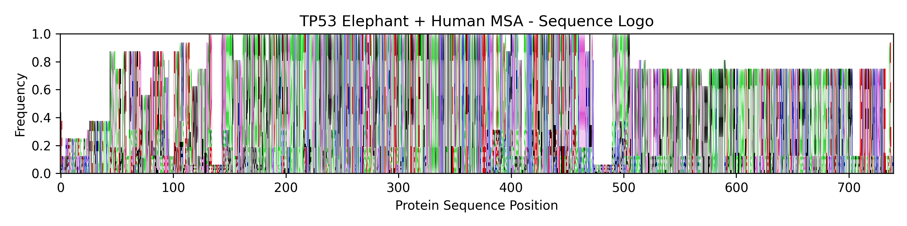
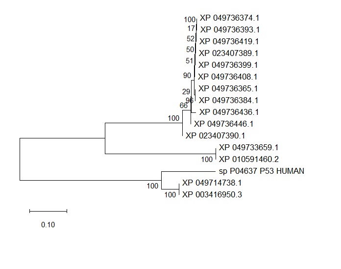
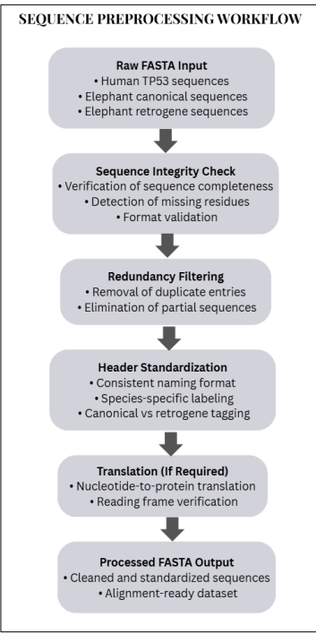
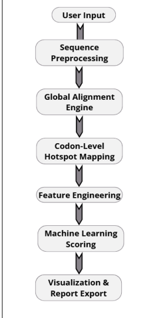
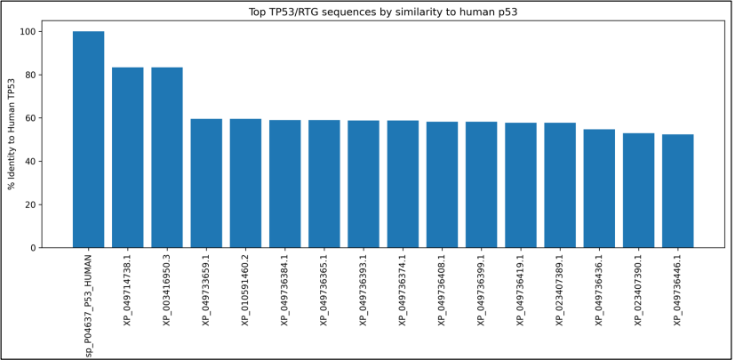

<div align="center">



# Elephant TP53 Hotspot Mapping

### Comparative in-silico mapping of recurrent human TP53 cancer hotspots in elephant TP53-related protein sequences

**Ritika Rajendra Rawat · Sermarani Nadar · Gursimran Kaur Uppal**

`Comparative Genomics` · `TP53 Biology` · `Evolutionary Oncology` · `Protein Bioinformatics`

[Published Research](manuscript/Published_Research.pdf) ·
[Thesis](manuscript/Thesis.pdf) ·
[EleProtect](EleProtect_App/) ·
[Methodology](docs/methodology.md) ·
[Citation](CITATION.cff)

</div>

---

## Why I started this project

This project began with a question that I kept coming back to while reading about **Peto's paradox**.

Elephants have many more cells and long lifespans compared with humans, yet their cancer incidence does not increase in the simple way that cell number alone would suggest.

TP53 is often discussed in this context because elephant genomes contain an unusual TP53-related repertoire.

That made me curious about a more focused sequence-level question:

> **What happens if the recurrent TP53 residues that are important in human cancer are mapped directly onto elephant TP53 and TP53-related protein sequences?**

I did not want to begin by assuming that elephant TP53 biology explains cancer resistance.

Instead, I wanted to start with something that could be measured directly from sequence data:

**Are the human cancer-associated residues still present at the corresponding positions?**

That question became the starting point for this repository.

---

# The question I actually tested

I focused on six well-known human TP53 cancer hotspot positions:

```text
R175
G245
R248
R249
R273
R282
```

The analysis asks:

> **How strongly are the exact human TP53 residues at these six positions preserved across the curated comparative protein set?**

An important terminology point:

In this repository, when I use the phrase **hotspot conservation**, I mean:

> **exact amino-acid identity at an alignment-mapped human TP53 position**

I am **not** using the term as a formal phylogenetic evolutionary-conservation statistic.

That distinction became increasingly important as the project developed.

---

# The dataset

The historical exploratory feature table contains:

| Component | Value |
|---|---:|
| Total protein records | **16** |
| Human TP53 reference | **1** |
| Non-reference comparative records | **15** |
| Human reference | **UniProt P04637** |
| Human TP53 length | **393 aa** |
| Hotspots examined | **6** |

The main analysis-ready FASTA is:

[`data/processed/TP53_clean.fasta`](data/processed/TP53_clean.fasta)

The repository also retains focused sequence sets used during different stages of the project:

```text
data/processed/
├── TP53_all_sequences.fasta
├── TP53_clean.fasta
├── human_elephant_tp53_pair.fasta
└── human_elephant_tp53_retrogene_comparison.fasta
```

I kept these files rather than presenting only the final table because they show how the comparison was narrowed and reorganised during the analysis.

---

# What I observed

## 1. The six human cancer hotspots show strong local residue preservation

The historical hotspot table reports:

| Human position | Human residue | Exact-residue identity |
|---:|:---:|---:|
| **175** | R | **90.91%** |
| **245** | G | **100.00%** |
| **248** | R | **90.91%** |
| **249** | R | **100.00%** |
| **273** | R | **100.00%** |
| **282** | R | **90.91%** |

Across these six positions, the mean identity is approximately:

```text
95.45%
```

The original result table can be inspected directly:

[`results/ML/TP53_hotspot_analysis.csv`](results/ML/TP53_hotspot_analysis.csv)

What interested me was not simply that several positions reached 100%.

It was that this strong **local** signal appeared while the proteins themselves could be considerably more different when compared across their complete sequences.

---

## 2. Local hotspot preservation and whole-protein similarity tell different stories

When I looked at global sequence identity to human TP53, the non-reference records ranged from:

```text
52.42% → 83.33%
```

Across the 15 non-reference records:

```text
Mean identity   ≈ 60.90%
Median identity = 58.78%
```

So the pattern that caught my attention was:

```text
protein-wide sequence
        ↓
substantial divergence

but

selected TP53 hotspot positions
        ↓
strong residue preservation
```

This does **not** mean that the remaining sequence is unimportant.

It simply tells me that global similarity and residue-specific correspondence answer different biological questions.

<p align="center">
  <a href="results/ML/identity_barplot.png">
    
  </a>
</p>

---

# The two highest-similarity records

Two non-reference sequences stand out in the historical similarity table:

```text
XP_049714738.1    83.33%
XP_003416950.3    83.33%
```

The ranking can be inspected here:

[`results/ML/top10_tp53_like.csv`](results/ML/top10_tp53_like.csv)

I treat this only as a **descriptive sequence-similarity ranking**.

I do not interpret higher sequence identity as proof of:

- functional equivalence,
- active tumour-suppressor function,
- orthology by itself,
- retrogene activity,
- or stronger biological protection against cancer.

Those questions require additional evidence.

---

# The figure that summarises the original comparison

<p align="center">
  <a href="figures/Figure7_composite_scores.png">
    
  </a>
</p>

This figure represents the part of the project I would show first when explaining the original question:

**Where do the human cancer-associated residues appear in the elephant-focused comparison, and how consistently are they retained?**

---

# How I approached the analysis

My working logic was approximately:

```text
Human TP53 reference
        │
        │  P04637
        ▼
Define cancer-associated hotspots
        │
        ▼
Collect elephant TP53-related proteins
        │
        ▼
Clean and validate sequences
        │
        ▼
Align against human TP53
        │
        ▼
Map human residue coordinates
        │
        ▼
Inspect exact amino-acid identity
        │
        ├──────────────┐
        │              │
        ▼              ▼
Hotspot-level      Protein-wide
comparison         similarity
        │              │
        └───────┬──────┘
                ▼
       Biological interpretation
                │
                ▼
      Ask what the sequence data
        can — and cannot — say
```

I later formalised much of this workflow in:

[`scripts/TP53_Comparative_Analysis.py`](scripts/TP53_Comparative_Analysis.py)

---

# What the current analysis script does

The current script is more explicit than some of the earlier exploratory analysis.

It:

1. locates the repository structure,
2. loads `TP53_clean.fasta`,
3. validates protein sequences,
4. identifies human TP53 using **UniProt P04637**,
5. checks the expected human length of **393 aa**,
6. calculates sequence-level features,
7. performs global pairwise alignment,
8. maps the six human hotspot coordinates through each alignment,
9. separates exact identity from substitution, gaps and unmapped positions,
10. excludes the human reference from comparative denominators,
11. optionally explores clustering in sequence-feature space,
12. generates CSV/JSON outputs,
13. and produces summary figures.

The hotspot definitions are explicit in the code:

```python
HOTSPOTS = {
    175: "R175",
    245: "G245",
    248: "R248",
    249: "R249",
    273: "R273",
    282: "R282",
}
```

The alignment scoring parameters are also recorded rather than being hidden defaults:

```python
ALIGNMENT_MATCH_SCORE = 1.0
ALIGNMENT_MISMATCH_SCORE = -1.0
ALIGNMENT_GAP_OPEN_SCORE = -2.0
ALIGNMENT_GAP_EXTEND_SCORE = -0.5
```

This was important to me because hotspot mapping is only meaningful if the coordinate mapping itself can be inspected.

---

# Why I separate exact identity from "conservation"

One thing I would explain differently now compared with when I first started the project is the word **conservation**.

For a focused human–elephant comparison, saying:

> “position 249 is conserved”

sounds simple.

But several questions are hidden inside that sentence:

- Which sequences were compared?
- Was the human sequence included in the denominator?
- How was the position mapped through gaps?
- Are we measuring exact residue identity?
- Are sequences orthologous proteins or TP53-related sequences?
- Is this pairwise correspondence or phylogenetically modelled conservation?

For that reason, the current script reports the more precise quantity:

> **exact amino-acid identity at an alignment-mapped human hotspot**

I still use "hotspot conservation" informally in some historical files because those files represent earlier stages of the project, but this README uses the more specific interpretation wherever possible.

---

# My favourite observation from this project

The number that interested me most was not a machine-learning score.

It was this contrast:

<div align="center">

### Hotspot identity

# ~95.45%

versus

### Mean non-reference whole-protein identity

# ~60.90%

</div>

These values should not be statistically compared as though they were measurements of the same quantity.

They are not.

But biologically, the contrast gave me a useful question to pursue:

> **Can functionally important positions remain locally stable even when TP53-related sequences accumulate substantial divergence elsewhere?**

That question eventually pushed me toward a broader comparative evolutionary analysis instead of treating the elephant comparison as the final answer.

---

# Multiple-sequence and phylogenetic context

The repository also contains alignment and phylogenetic outputs used to explore how the analysed records relate to one another.

<p align="center">
  <a href="figures/Figure4_MSA.png">
    
  </a>
</p>

<p align="center">
  <a href="figures/Figure6_phylogenetic_tree.png">
    
  </a>
</p>

Machine-readable/tree outputs are available under:

[`results/phylogeny/`](results/phylogeny/)

including:

```text
TP53_tree.nwk
TP53_tree.png
Guide Tree.tree
Phylogenetic Tree.phylotree
```

I use these results as **comparative context**, not as evidence that all sequences have identical biological roles.

Sequence relatedness and functional equivalence are different questions.

---

# A note on the exploratory machine-learning part

There is a machine-learning component in this repository, but I want to be precise about what it means.

The historical workflow includes sequence-derived features and exploratory clustering:

```text
sequence
   ↓
feature extraction
   ↓
sequence similarity
   ↓
feature-space clustering
```

Relevant files include:

[`results/ML/basic_features.csv`](results/ML/basic_features.csv)

[`results/ML/tp53_features_with_similarity.csv`](results/ML/tp53_features_with_similarity.csv)

[`results/ML/tp53_features_with_similarity_clustered.csv`](results/ML/tp53_features_with_similarity_clustered.csv)

This clustering is an **exploratory computational view of the feature space**.

It is not:

```text
a cancer classifier
a clinical prediction model
a validated TP53-function predictor
a diagnostic model
or evidence of elephant cancer resistance
```

This distinction matters because a clustering result can look visually convincing even when its biological interpretation remains uncertain.

---

# EleProtect

During the project I also wanted a way to interact with the analysis without repeatedly opening individual CSV files and plots.

That led to **EleProtect**, a Streamlit-based research interface included under:

[`EleProtect_App/`](EleProtect_App/)

<p align="center">
  
</p>

The application explores:

```text
TP53 sequence input
        ↓
sequence processing
        ↓
hotspot mapping
        ↓
feature extraction
        ↓
exploratory ranking
        ↓
interactive output
```

It contains separate source files for the interface, model experimentation and supporting utilities:

```text
EleProtect_App/
├── app.py
├── model.py
├── utils.py
├── train_model.py
├── generate_training_dataset.py
├── requirements.txt
└── data/
```

EleProtect is best understood as a **research prototype for exploring the workflow**.

I would not use it for:

- diagnosis,
- individual cancer-risk estimation,
- prognosis,
- treatment selection,
- or clinical decision support.

---

# What the project does not prove

This is probably the most important section of the README.

The sequence observations in this repository do **not** demonstrate that:

> elephants resist cancer because these six TP53 positions are preserved.

They also do not demonstrate that TP53 alone resolves Peto's paradox.

This analysis supports a narrower statement:

> **Several recurrent human TP53 cancer-associated residues show strong exact-residue preservation across the curated elephant-focused comparative sequence set.**

From there, it is reasonable to generate biological hypotheses.

It is not reasonable to jump directly to mechanism.

A useful evidence hierarchy for me is:

```text
sequence observation
        ↓
computational evidence
        ↓
biological hypothesis
        ↓
mechanistic evidence
        ↓
experimental validation
```

This repository mostly operates in the first two layers.

---

# Where I would be careful as a reviewer

There are several limitations I would want someone evaluating this work to notice.

### Sequence selection

The result depends on which elephant TP53 and TP53-related records are included and how they are annotated.

### Alignment

Human-coordinate mapping depends on the alignment method and its parameters.

### TP53-related sequences are not automatically functionally equivalent

A sequence can resemble TP53 without having the same expression, regulation, stability or tumour-suppressor function.

### Exact residue identity is a limited metric

It captures whether the amino acid is retained.

It does not quantify evolutionary selection, biochemical effect or structural importance by itself.

### Protein-wide similarity and hotspot identity are different denominators

The ~95.45% hotspot value and ~60.90% whole-protein value should therefore not be treated as a formal effect-size comparison.

### Machine learning is exploratory

Clustering or ranking of sequence features has not been experimentally validated as a biological classification system.

### No clinical inference

Nothing here should be interpreted as a diagnostic or therapeutic model.

The detailed boundary is documented in:

[`docs/interpretation_and_limitations.md`](docs/interpretation_and_limitations.md)

---

# Historical outputs versus the current script

This repository grew over time.

Because of that, there are **two related analytical layers** inside it.

### Historical analysis artifacts

A number of the published/exploratory results are stored under:

```text
results/ML/
results/MSA/
results/MEGA/
results/phylogeny/
```

These include the hotspot table, similarity features, clustering outputs, older alignments and figures used during the original project.

### Current comparative-analysis implementation

The newer:

[`scripts/TP53_Comparative_Analysis.py`](scripts/TP53_Comparative_Analysis.py)

uses a more explicit analysis contract.

It is designed to generate outputs such as:

```text
results/tp53_sequence_features.csv
results/tp53_hotspot_mapping.csv
results/tp53_hotspot_identity_summary.csv
results/tp53_comparative_features.csv
results/tp53_comparative_features_clustered.csv
results/tp53_excluded_sequences.csv
results/tp53_summary.json
```

These paths are different from several historical `results/ML/` artifacts.

I am keeping that distinction visible rather than pretending that every file in the repository came from a single final pipeline run.

For exact artifact relationships, see:

[`docs/artifact_index.md`](docs/artifact_index.md)

and:

[`docs/reproducibility.md`](docs/reproducibility.md)

---

# How I would reproduce the current analysis

Clone the repository:

```bash
git clone https://github.com/Rita1791/Elephant-TP53-Hotspot-Mapping.git
cd Elephant-TP53-Hotspot-Mapping
```

Create an environment:

```bash
python -m venv .venv
```

On Linux/macOS:

```bash
source .venv/bin/activate
```

On Windows:

```powershell
.venv\Scripts\activate
```

Install the analysis dependencies:

```bash
python -m pip install --upgrade pip
python -m pip install -r requirements.txt
```

Run the current analysis:

```bash
python scripts/TP53_Comparative_Analysis.py
```

Run the tests:

```bash
pytest -q
```

The main environment currently includes:

```text
Biopython 1.81
NumPy 1.26.4
pandas 2.2.3
Matplotlib 3.9.4
Seaborn 0.13.2
scikit-learn 1.5.2
pytest 8.3.5
```

The EleProtect application has its own dependency file:

[`EleProtect_App/requirements.txt`](EleProtect_App/requirements.txt)

---

# Repository map

```text
Elephant-TP53-Hotspot-Mapping/
│
├── data/
│   ├── raw/
│   └── processed/
│       ├── TP53_all_sequences.fasta
│       ├── TP53_clean.fasta
│       ├── human_elephant_tp53_pair.fasta
│       └── human_elephant_tp53_retrogene_comparison.fasta
│
├── scripts/
│   ├── TP53_Comparative_Analysis.py
│   └── prioritization.py
│
├── results/
│   ├── ML/
│   ├── MEGA/
│   ├── MSA/
│   ├── MSA_1and2/
│   ├── MSA_3/
│   ├── phylogeny/
│   ├── README.md
│   └── summary.md
│
├── figures/
│   ├── Figure1_TP53_copy_number.png
│   ├── Figure2_preprocessing_workflow.png
│   ├── Figure3_pipeline.png
│   ├── Figure4_MSA.png
│   ├── Figure5_hotspot_mapping.png
│   ├── Figure6_phylogenetic_tree.png
│   └── Figure7_composite_scores.png
│
├── EleProtect_App/
│   ├── app.py
│   ├── model.py
│   ├── train_model.py
│   ├── utils.py
│   └── data/
│
├── docs/
│   ├── methodology.md
│   ├── interpretation_and_limitations.md
│   ├── reproducibility.md
│   ├── provenance.md
│   ├── artifact_index.md
│   └── relationship_to_companion_repositories.md
│
├── manuscript/
│   ├── Published_Research.pdf
│   └── Thesis.pdf
│
├── notebooks/
├── config/
├── tests/
├── requirements.txt
├── pytest.ini
├── CITATION.cff
├── LICENSE
└── README.md
```

---

# Figures from the research journey

I kept the original figures because they also show how the thinking behind the project developed.

<table>
<tr>
<td width="50%" align="center">

<a href="figures/Figure2_preprocessing_workflow.png">

</a>

**Sequence preprocessing**

</td>
<td width="50%" align="center">

<a href="figures/Figure3_pipeline.png">

</a>

**Original analysis pipeline**

</td>
</tr>

<tr>
<td width="50%" align="center">

<a href="figures/Figure5_hotspot_mapping.png">

</a>

**Hotspot mapping**

</td>
<td width="50%" align="center">

<a href="figures/Figure6_phylogenetic_tree.png">

</a>

**Phylogenetic context**

</td>
</tr>
</table>

---

# What I learned from doing this project

Looking back, the most useful part of this work was not obtaining a high percentage for a set of TP53 residues.

It was learning where a comparative-genomics observation stops and a biological claim begins.

### I initially thought hotspot conservation was the result

It is a result.

But the more important question is what that conservation means.

Exact identity tells me that a residue has been retained in the sequences I compared.

It does not automatically tell me why it was retained.

---

### Sequence similarity is easy to calculate and easy to overinterpret

Two proteins can have high sequence identity and still differ in biological context.

Conversely, proteins with substantial divergence can preserve specific residues that remain important to a shared structural region.

That is why I stopped treating whole-protein identity as the only relevant measure.

---

### The dataset definition matters as much as the calculation

When analysing gene families, paralogues or TP53-related sequences, the result can change depending on which records enter the analysis.

That made sequence curation and identifier tracking more important to me than they seemed at the beginning of the project.

---

### A computational result should survive a change in wording

One test I now use when writing results is:

> *Can I describe this observation without using a biologically stronger word than the calculation actually supports?*

For example:

```text
"exact residue identity"
```

is safer than automatically writing:

```text
"functional conservation"
```

unless function has actually been demonstrated.

---

# What I would improve if I restarted the project today

This is an older project compared with the way I now approach comparative-genomics analysis, and there are several things I would change.

## 1. Separate canonical TP53 from TP53-related sequences more aggressively

I would define explicit evidence groups before analysis:

```text
canonical TP53
        │
        ├── orthologous TP53
        │
        ├── annotated TP53-related sequences
        │
        └── candidate retrogene-derived proteins
```

and avoid combining them into one interpretation layer unless the biological question specifically justified it.

---

## 2. Record complete accession provenance

For each sequence, I would retain:

```text
accession
species
protein description
source database
sequence version
retrieval date
classification
inclusion reason
exclusion reason
```

This would make the curation process easier to audit.

---

## 3. Use a stronger evolutionary framework

The hotspot mapping in this repository is intentionally simple.

A more complete follow-up would include:

- larger mammalian taxon sampling,
- explicit orthology checking,
- phylogenetically informed conservation,
- ancestral sequence reconstruction,
- codon-level evolutionary models,
- residue-wise selection analysis,
- structural mapping,
- and experimentally informed functional interpretation.

---

## 4. Keep exploratory ML secondary to the biological question

If I used machine learning again, I would start with a clearly defined biological prediction target rather than adding clustering simply because sequence features are available.

Exploratory clustering can help inspect the dataset.

It should not become the scientific conclusion.

---

# How this project grew into my broader TP53 work

This repository was a **focused human–elephant starting point**.

The main question here is:

> How do human cancer-associated TP53 hotspots map onto elephant TP53 and TP53-related protein sequences?

That work later motivated me to ask a stricter and broader question:

> Are recurrent human TP53 hotspots unusually evolutionarily constrained across mammals?

That second question became a separate project:

### [TP53 Evolutionary Conservation Across Mammals](https://github.com/Rita1791/TP53-Evolutionary-Conservation-Mammals)

The two repositories are intentionally separate.

They should not be interpreted as independent replications of the same dataset.

```text
Human–elephant hotspot mapping
            │
            │ generated a broader question
            ▼
56-sequence mammalian conservation study
            │
            ▼
domain-matched statistics
phylogenetic sensitivity
cancer-recurrence integration
```

The relationship is documented in:

[`docs/relationship_to_companion_repositories.md`](docs/relationship_to_companion_repositories.md)

For me, this progression is more meaningful than pretending the first project already answered the larger evolutionary question.

---

# Publication

The associated published research is available in the repository:

### [Open Published Research PDF](manuscript/Published_Research.pdf)

The thesis version is also retained:

### [Open Thesis PDF](manuscript/Thesis.pdf)

Published work:

**Rawat, Ritika Rajendra; Nadar, Sermarani; Uppal, Gursimran Kaur.**

*Comparative In-Silico Mapping of TP53 Mutation Hotspots in Elephants: A Responsible Bioinformatics Innovation Contributing to Cancer Research.*

**Ideathon on Vikshit Bharat: Ideas, Innovation and Impact**, 2026, pp. 123–138.

DOI:

```text
10.25215/9141002199
```

Machine-readable citation metadata is available in:

[`CITATION.cff`](CITATION.cff)

---

# Research lineage and ECCB 2026

The broader mammalian extension of this work was subsequently selected for presentation at **ECCB 2026** in Geneva.

I consider the elephant project the focused starting point rather than another version of the same analysis.

The progression was:

```text
Focused elephant comparison
        ↓
questions about evolutionary constraint
        ↓
expanded mammalian dataset
        ↓
domain-matched statistical testing
        ↓
human cancer recurrence integration
```

That progression is also why I have kept this repository available even though the later mammalian project uses a stronger comparative framework.

It records how the research question developed.

---

# If you are reviewing this repository

The files I would inspect first are:

### Biological input

[`data/processed/TP53_clean.fasta`](data/processed/TP53_clean.fasta)

### Historical hotspot result

[`results/ML/TP53_hotspot_analysis.csv`](results/ML/TP53_hotspot_analysis.csv)

### Sequence similarity table

[`results/ML/tp53_features_with_similarity.csv`](results/ML/tp53_features_with_similarity.csv)

### Current analysis implementation

[`scripts/TP53_Comparative_Analysis.py`](scripts/TP53_Comparative_Analysis.py)

### Method

[`docs/methodology.md`](docs/methodology.md)

### Interpretation boundary

[`docs/interpretation_and_limitations.md`](docs/interpretation_and_limitations.md)

### Reproducibility notes

[`docs/reproducibility.md`](docs/reproducibility.md)

### Published research

[`manuscript/Published_Research.pdf`](manuscript/Published_Research.pdf)

---

# The conclusion I am comfortable defending

I do **not** conclude that this analysis explains why elephants have lower-than-expected cancer incidence.

The sequence evidence supports something much narrower:

> **Recurrent human TP53 cancer-associated hotspot residues show strong exact-residue preservation across the curated elephant-focused TP53 comparative dataset, even though the analysed TP53-related proteins show considerably greater divergence at the whole-protein level.**

That observation is biologically interesting.

It is also only one piece of a much larger problem.

The next steps require better evolutionary modelling, clearer sequence classification, structural evidence and experimental biology.

For me, that boundary is part of the result rather than something to hide in the final paragraph.

---

## Contact

**Ritika Rajendra Rawat**

GitHub: [Rita1791](https://github.com/Rita1791)  
LinkedIn: [Ritika Rawat](https://in.linkedin.com/in/ritika-rawat-551107219)  
ResearchGate: [Ritika Rawat](https://www.researchgate.net/profile/Ritika-Rawat-10)  
Email: [ritika.rawat27@outlook.com](mailto:ritika.rawat27@outlook.com)

---

## License

Code and repository-created materials are provided under the [MIT License](LICENSE).

External sequence databases and biological resources retain their respective licences, terms of use and citation requirements.

---

<div align="center">

### One line I would keep from this project

## Strong sequence preservation is a clue — not a mechanism.

The elephant comparison gave me the clue.  
The broader evolutionary work came from asking what that clue actually meant.

</div>
